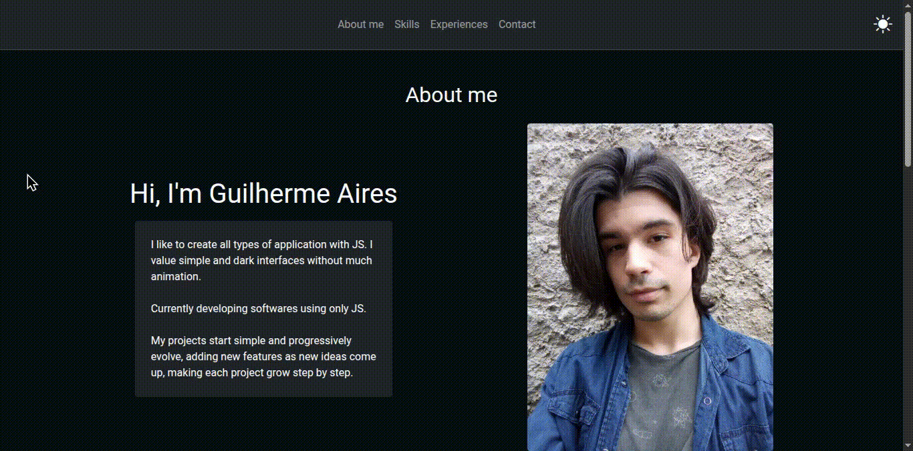

[](https://portfolio-guilherme-aires.netlify.app/)
[](/license.txt)

# My portfolio

Here you'll find a collection of my projects, skills and professional info, shown in a simple and responsive way.

## About the project

This is my online portfolio, developed to display my main projects, skills, techniques, career path and ways to contact me. The objective is to centralize all significant info about me, demonstrating my capabilities as a developer and making it easy to contact possible recruiters or partners.

## Technologies

- JavaScript
- HTML
- CSS
- Bootstrap

## Functionality

- Personal presentation.
- Projects section with description and links.
- List of technologies.
- Contact link.
- Responsive layout for desktop and mobile devices.

## Demo
[]()

## How to locally run the project

1. Clone the repository.
```bash
git clone https://github.com/irmaodoguilherme/portfolio.git
```

2. Navigate to the project's folder.
```bash
cd portfolio
```

3. Run it locally using LiveServer in VSCode.

> Alternative: [click here](https://portfolio-guilherme-aires.netlify.app/) or use the link in the `About` section.

## Contribution

This is a personal project, but suggestions and feedback are always welcome! Feel free to open an issue or pull request.

## License

This project is under the [MIT License](/license.txt).

## Contact

- E-mail: [contatoguilherme83@gmail.com](mailto:contatoguilherme83@gmail.com)
- LinkedIn: https://www.linkedin.com/in/guilherme-aires-8a3ab4282/
- GitHub: https://github.com/irmaodoguilherme/

## Notes

This portfolio will be constantly updated with new projects and improvements. Feel free to visit anytime you want to know more about my work.